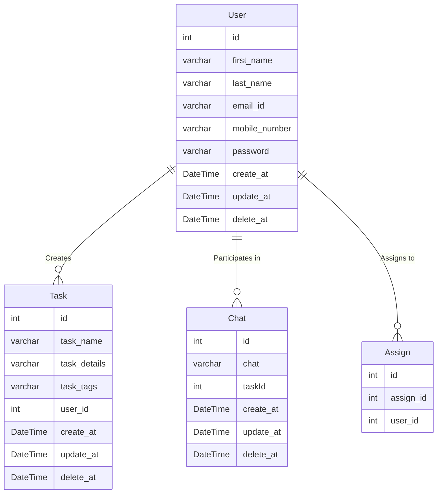

```mermaid

erDiagram
User ||--o{ Task : "Creates"
User ||--o{ Chat : "Participates in"
User ||--o{ Assign : "Assigns to"

    User {
        int id
        varchar first_name
        varchar last_name
        varchar email_id
        varchar mobile_number
        varchar password
        DateTime create_at
        DateTime update_at
        DateTime delete_at
    }

    Task {
        int id
        varchar task_name
        varchar task_details
        varchar task_tags
        int user_id
        DateTime create_at
        DateTime update_at
        DateTime delete_at
    }

    Chat {
        int id
        varchar chat
        int taskId
        DateTime create_at
        DateTime update_at
        DateTime delete_at
    }

    Assign {
        int id
        int assign_id
        int user_id
    }

```
