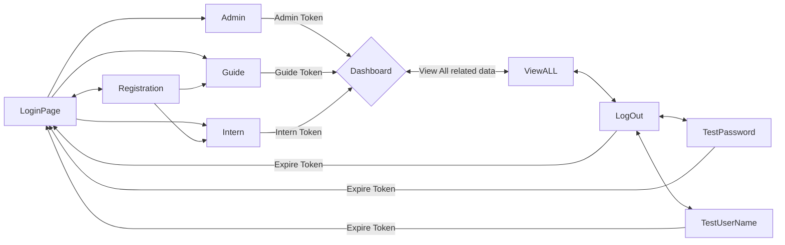
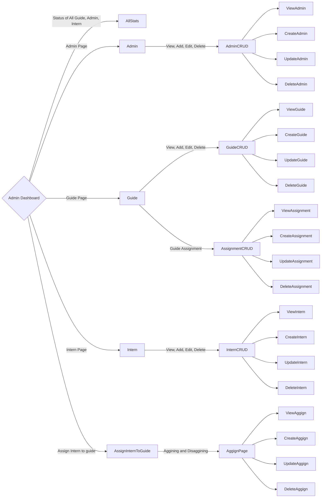
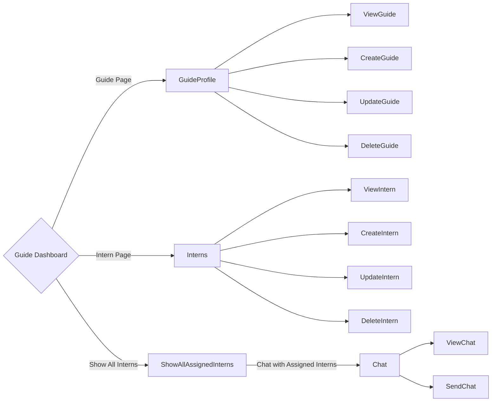
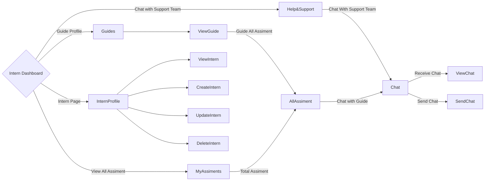

# Website Flow

## Basic Flow of website

```mermaid
flowchart LR
    %% Login Registration Flow
    LoginPage <--> Registration

    %% Admin Dashboard Flow
    LoginPage --> Admin

    %% Guide Dashboard Flow
    LoginPage --> Guide
    Registration --> Guide

    %% Intern Dashboard Flow
    LoginPage --> Intern
    Registration --> Intern

    %% All Dashboard Flow
    Admin -->| Admin Token | DB{Dashboard}
    Guide -->| Guide Token | DB
    Intern --> | Intern Token | DB
    DB <--> | View All related data | ViewALL
    ViewALL <--> LogOut -->| Expire Token | LoginPage
    LogOut <--> TestPassword -->| Expire Token | LoginPage
    LogOut <--> TestUserName -->| Expire Token | LoginPage
```

## Admin Flow of website

```mermaid
flowchart LR

    %% Dashboard Flow
    DB{Admin Dashboard} -->| Status of All Guide, Admin, Intern |AllStats
    DB -->| Admin Page | Admin
    DB -->| Guide Page | Guide
    DB -->| Intern Page | Intern
    DB -->| Assign Intern to guide | AssignInternToGuide

    %% Admin Flow
    Admin -->| View, Add, Edit, Delete |AdminCRUD
    AdminCRUD --> ViewAdmin
    AdminCRUD --> CreateAdmin
    AdminCRUD --> UpdateAdmin
    AdminCRUD --> DeleteAdmin

    %% Guide Flow
    Guide -->| View, Add, Edit, Delete | GuideCRUD
    GuideCRUD --> ViewGuide
    GuideCRUD --> CreateGuide
    GuideCRUD --> UpdateGuide
    GuideCRUD --> DeleteGuide

    %% Assignment Flow
    Guide -->|Guide Assignment| AssignmentCRUD
    AssignmentCRUD --> ViewAssignment
    AssignmentCRUD --> CreateAssignment
    AssignmentCRUD --> UpdateAssignment
    AssignmentCRUD --> DeleteAssignment

    %% Intern Flow
    Intern -->| View, Add, Edit, Delete | InternCRUD
    InternCRUD --> ViewIntern
    InternCRUD --> CreateIntern
    InternCRUD --> UpdateIntern
    InternCRUD --> DeleteIntern

    %% AssignInternToGuide
    AssignInternToGuide -->| Aggining and Disaggining | AggignPage
    AggignPage --> ViewAggign
    AggignPage --> CreateAggign
    AggignPage --> UpdateAggign
    AggignPage --> DeleteAggign
```

## Guide Flow of website

```mermaid
flowchart LR
    DB{Guide Dashboard} -->| Guide Page | GuideProfile

    %% Guide Profile
    GuideProfile --> ViewGuide
    GuideProfile --> CreateGuide
    GuideProfile --> UpdateGuide
    GuideProfile --> DeleteGuide

    %% View Intern
    DB -->| Intern Page | Interns
    DB -->| Show All Interns | ShowAllAssignedInterns
    Interns --> ViewIntern
    Interns --> CreateIntern
    Interns --> UpdateIntern
    Interns --> DeleteIntern
    ShowAllAssignedInterns --> |Chat with Assigned Interns| Chat
    Chat --> ViewChat
    Chat --> SendChat
```

## Intern Flow of website

```mermaid
flowchart LR
    DB{Intern Dashboard} -->| Intern Page | InternProfile
    DB -->| Guide Profile | Guides --> ViewGuide -->| Guide All Assiment | AllAssiment
    DB -->| View All Assiment | MyAssiments -->| Total Assiment | AllAssiment
    DB -->| Chat with Support Team | Help&Support -->| Chat With Support Team | Chat

    %% Intern Profile
    InternProfile --> ViewIntern
    InternProfile --> CreateIntern
    InternProfile --> UpdateIntern
    InternProfile --> DeleteIntern

    %% Chat With Guide
    AllAssiment --> | Chat with Guide | Chat
    Chat -->| Receive Chat | ViewChat
    Chat -->| Send Chat | SendChat
```
